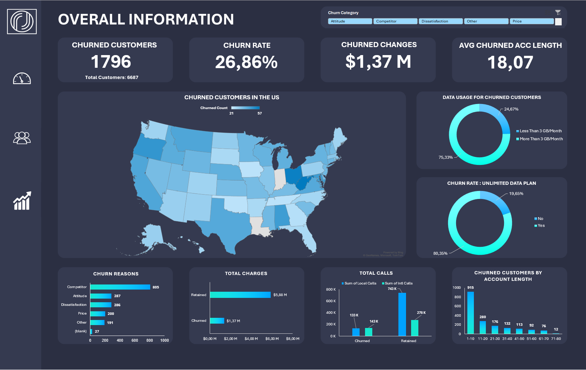
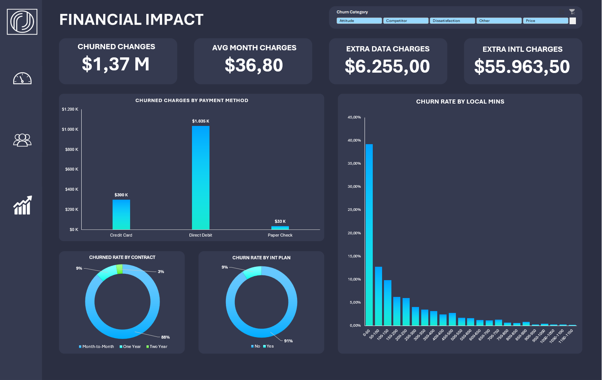
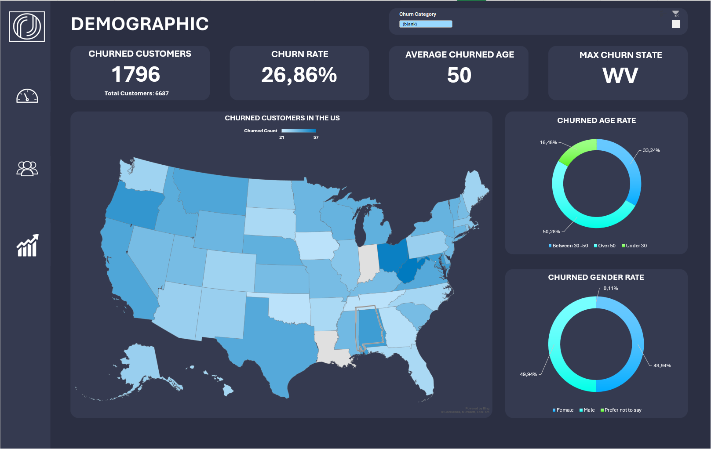

# 📉 Analyzing Customer Churn in Excel: A Telecom Retention Case Study

> Turning 6,687 telecom subscriber records into a prioritized retention strategy — built entirely in Excel with PivotTables, calculated columns, and an interactive dashboard.


---

## 📌 Overview

For a subscription telecom, retention *is* the business model. Acquiring a customer carries a fixed cost that is only recovered over months of billing, so every early departure erases the margin the relationship was meant to earn. Cutting churn is therefore a direct lever on profit — often a cheaper one than chasing new customers.

This project analyzes **6,687 customer records** from the telecom operator **Databel** to answer three operational questions: **how much churn there is, why customers leave, and which interventions would recover the most revenue** — all within Microsoft Excel.

The headline finding is a churn rate of **26.86%** — more than one customer in four — representing **$1,367,515 in lost lifetime billing** and roughly **32% of monthly recurring revenue**. The strongest lever is not pricing but **contract structure**: month-to-month customers churn at **46.3%** versus **2.8%** on two-year terms and make up **~88%** of all departures. A second, highly actionable signal is the **customer-service call count**, where churn climbs from under **9%** (no calls) to effectively **100%** (four or more) — a near-perfect early-warning trigger.

---

## 🔑 Key Findings

| Theme | Finding |
|---|---|
| **Scale** | **26.86%** churn (1,796 of 6,687 customers), worth **$1.37M** in lost lifetime revenue and ~**32%** of MRR |
| **Root cause** | **Competition** is the leading stated reason (**~45%** of churn) — better offers, devices, data, and speeds |
| **Contract** | Month-to-month churns **46.3%** vs. **2.8%** on two-year terms and drives **~88%** of all churn |
| **Service calls** | Churn escalates from **8.9%** (0 calls) to **99.7%** (4+ calls) — an observable, real-time risk trigger |
| **Tenure** | Churn is front-loaded: **~49%** of first-10-month customers leave, then it falls every year |
| **Stickiness** | Group contracts (**6.5%**) and auto-pay retain far better than individuals (**32.8%**) and paper-check payers (**38.0%**) |
| **High-value risk** | Churned customers carry a **higher** average monthly charge than retained ones — the business loses its better accounts |
| **Demographics** | Churn rises with age; **seniors (65+) churn at 38.5%** vs. **24.2%** for younger customers |

---

## 🗂️ Table of Contents

- [Business Problem](#-business-problem)
- [Dataset](#-dataset)
- [Methodology](#-methodology)
- [The Dashboard](#-the-dashboard)
- [Strategic Recommendations](#-strategic-recommendations)
- [Project Structure](#-project-structure)
- [How to Use the Workbook](#-how-to-use-the-workbook)
- [License](#-license)

---

## 🎯 Business Problem

Management can already see how many customers signed up and how much revenue came in, but routine reporting leaves the decisive questions unanswered:

- What share of the customer base is actually leaving, and what is it costing?
- *Why* are customers churning — and is the cause something Databel controls, or the competitive market?
- Which customer attributes most sharply separate leavers from stayers, so effort can be targeted?
- When in the customer lifecycle is churn risk highest?
- Which levers would recover the most revenue per unit of effort?

At its core this is a problem of **decision visibility**: a rich customer dataset exists, but it has not yet been turned into a ranked, quantified view of where retention effort should go.

---

## 💾 Dataset

**`data/databel_customer_data.xlsx`** — **6,687 customer records × 28 attributes**, one row per customer, covering four domains:

- **Customer status** — churn label, churn category, and churn reason
- **Demographics** — gender, age, under-30 and senior flags
- **Contract information** — contract type, payment method, state, group membership
- **Subscription & charges** — tenure, call and data usage, plans, service-call count, monthly and total charges

> **⚠️ A note on structural missingness.** Only two fields have missing values — *Churn Category* and *Churn Reason* — and both are blank for exactly the same rows. This is **structural, not erroneous**: these fields are populated only for customers who actually churned, so a retained customer legitimately has no churn reason. The blanks are **preserved** rather than filled, so the analysis never counts departures that did not occur. Every other field is fully populated.

---

## 🔬 Methodology

The entire analysis was carried out in **Microsoft Excel**, following a structured workflow:

1. **Data Quality Assessment** — checked completeness and confirmed that the only missing values (churn category/reason) are structural, not defects.
2. **Calculated Columns** — added derived fields to the raw data to enable segmentation:
   - a **data-usage band** (`< 3 GB` vs. `≥ 3 GB` per month)
   - an **age group** (`Under 30`, `Between 30–50`, `Over 50`)
   - an **account-length band** (tenure buckets)
3. **PivotTables** — aggregated churn across every dimension of interest — contract type, payment method, customer-service calls, data usage, demographics, and geography — to compute both **churn rate** and **churned-customer counts**.
4. **Dashboard** — wired the PivotTable outputs into an interactive, single-view dashboard across three sheets, with KPIs and charts.
5. **Synthesis** — translated the findings into prioritized, quantified recommendations (see the executive summary report).

---

## 📊 The Dashboard

The workbook is organized into five sheets:

| Sheet | Purpose |
|---|---|
| **Overall Information** | Headline KPIs (churn rate, customers lost, revenue lost, avg. account length) plus churn reasons, total charges, total calls, and data-usage charts |
| **Demographic** | Churn rate by age group and gender, with a senior-status breakdown |
| **Financial Impact** | Revenue lost to churn by payment method, contract type, and international plan |
| **Databel Data** | The full raw dataset with calculated columns and an auto-filter |
| **Pivot Summary** | The aggregated tables underlying every chart |

### Overall Information


**1,796 of 6,687 customers (26.86%)** have churned, taking **$1,367,515** in lifetime billing and ~**32%** of MRR. Competitor-related reasons dominate, and churn concentrates heavily in the first ten months of tenure.

### Financial Impact


Contract type is the clearest structural driver — month-to-month customers churn at **46.3%** versus **2.8%** on two-year terms. Direct-debit customers account for the largest share of churned charges by volume.

### Demographic


Churn rises with age: **seniors (65+) churn at 38.5%** against **24.2%** for younger customers, while gender shows essentially no difference.

---

## 🚀 Strategic Recommendations

- **Convert month-to-month customers to term contracts.** The single highest-leverage move: with month-to-month churn at 46.3% versus 2.8% on two-year terms, incentivized migration attacks the largest source of attrition directly.

- **Build a service-call early-warning trigger.** Route any customer reaching 2–3 support calls into a proactive retention flow, before they hit the near-certain-churn zone at four-plus calls.

- **Harden the first-year experience.** With ~49% of first-10-month customers leaving, structured onboarding and early check-ins convert new customers into surviving-year-one customers, where retention becomes durable.

- **Defend heavy-data users against competitors.** Unlimited-plan and 3GB-plus customers churn most and are exactly the segment rivals court on data and speed — pair sharper data propositions with pre-emptive retention offers.

- **Increase account stickiness.** Nudge customers from paper check toward auto-pay and promote group/family plans, both of which sharply lower churn (6.5% group vs. 32.8% individual) by raising switching costs.

### Key Takeaway

The largest retention gains lie in **contract conversion, proactive intervention on at-risk accounts, and a stronger first-year experience** — expected to recover more revenue than any change to pricing tiers or payment methods alone.

---

## 📁 Project Structure

```
databel-churn-analysis/
├── README.md                          # You are here
├── Databel_Churn_Dashboard.xlsx       # Main workbook: data, PivotTables, dashboard
├── Executive_Summary_Report.docx      # Detailed written report
├── data/
│   └── databel_customer_data.xlsx     # Source data (6,687 customers)
└── screenshots/
    ├── 01_overall_information.png
    ├── 02_demographic.png
    └── 03_financial_impact.png
```

---

## 🧭 How to Use the Workbook

1. **Open** `Databel_Churn_Dashboard.xlsx` in Microsoft Excel (2016 or later recommended).
2. **Start at the `Overall Information` tab** for the headline KPIs and the big picture.
3. **Explore `Demographic` and `Financial Impact`** for segment-level detail.
4. **Inspect `Pivot Summary`** to see the exact aggregated numbers behind each chart.
5. **Dig into `Databel Data`** — use the column auto-filter to slice the raw records yourself.

> All figures were computed from the source dataset. If you refresh or extend the data, re-running the PivotTables will update the dashboard.

---

## 📝 License

Released under the [MIT License](LICENSE).

---

*If this analysis was useful, consider giving the repo a ⭐*
